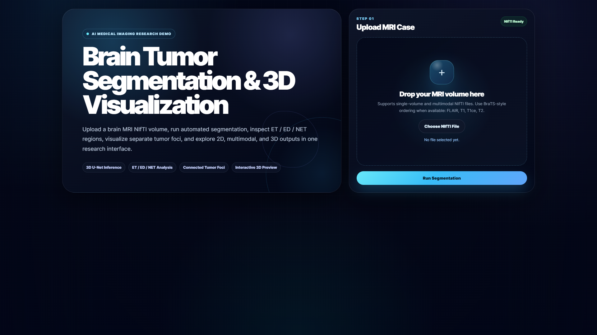
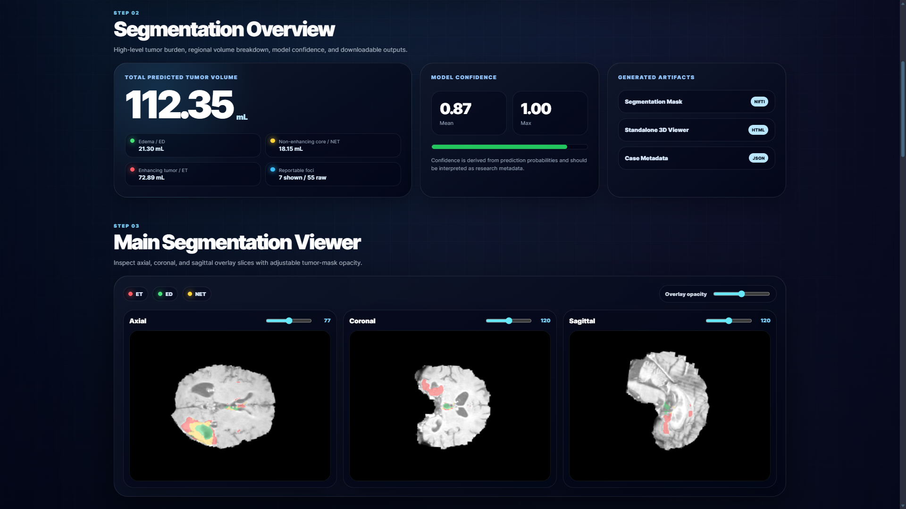
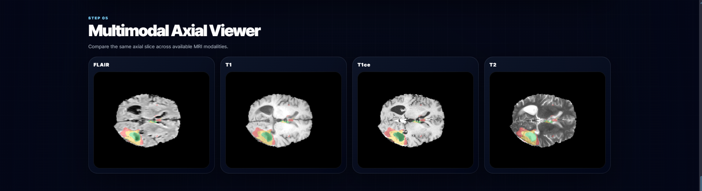
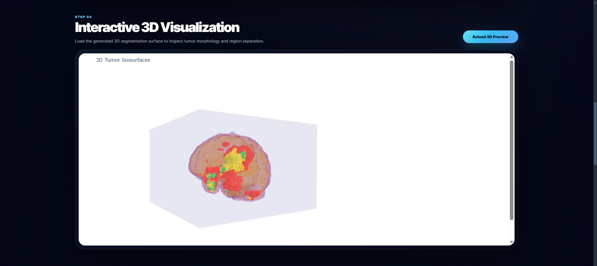
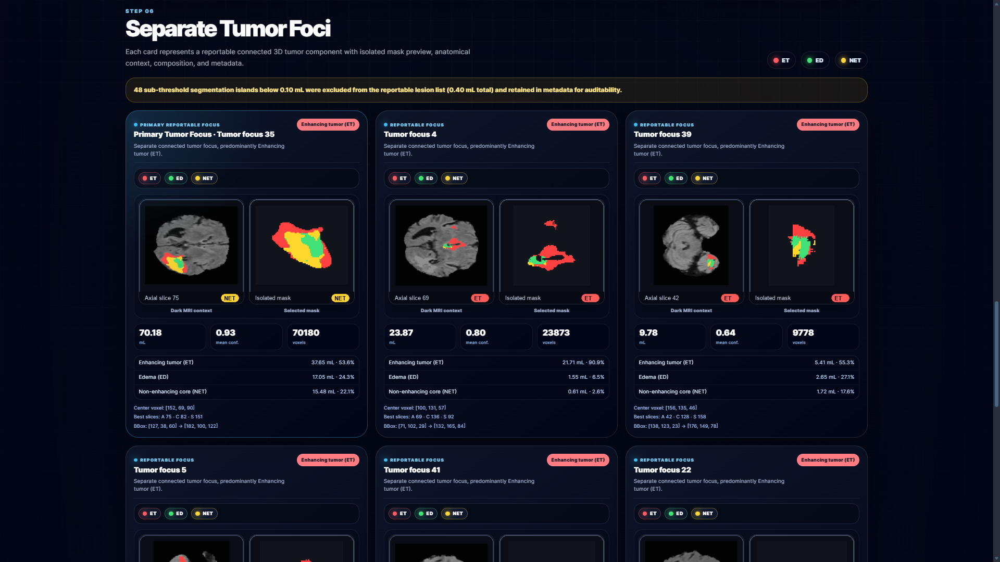
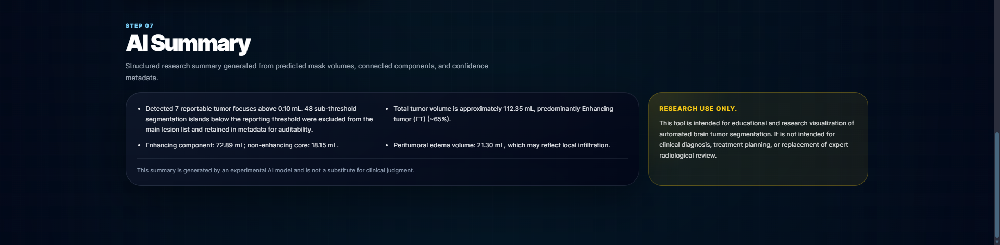

# Brain Tumor Segmentation and 3D Visualization


An AI-powered research web application for **brain tumor segmentation and 3D visualization** from MRI NIfTI volumes.

The application performs automated tumor segmentation, separates tumor regions into **ET / ED / NET**, estimates tumor volumes, detects separate connected tumor foci, displays per-focus metadata, and provides 2D, multimodal, and 3D visualization inside a modern research portfolio interface.

> **Research Use Only:** This project is intended for educational and research visualization. It is not intended for clinical diagnosis, treatment planning, or replacement of expert radiological review.

---

## Preview

### Research Portfolio Interface



### Segmentation Overview



### Multimodal Axial Viewer



### 3D Tumor Visualization



### Separate Tumor Foci



### AI Summary



---

## Key Features

* Brain tumor segmentation from MRI NIfTI volumes
* ET / ED / NET tumor region separation
* Total predicted tumor volume estimation
* Region-wise tumor volume calculation
* Separate connected tumor foci detection
* Sub-threshold segmentation island filtering
* Per-focus tumor metadata
* Per-focus dark MRI context preview
* Per-focus isolated segmentation mask preview
* Axial, coronal, and sagittal 2D overlay viewer
* Multimodal axial viewer for FLAIR, T1, T1ce, and T2
* Interactive 3D visualization
* Metadata JSON export
* Segmentation mask download
* Research portfolio-style frontend UI
* Runtime preview caching for faster tumor-focus card loading

---

## Tumor Region Legend

| Label   | Meaning                       | Visualization Color |
| ------- | ----------------------------- | ------------------- |
| **ET**  | Enhancing Tumor               | Red                 |
| **ED**  | Edema                         | Green               |
| **NET** | Non-enhancing / Necrotic Core | Yellow              |

---

## Project Workflow

```text
MRI NIfTI Upload
        ↓
Preprocessing
        ↓
Deep Learning Segmentation
        ↓
ET / ED / NET Region Extraction
        ↓
Connected Tumor Foci Detection
        ↓
2D Overlay + Multimodal Viewer
        ↓
3D Visualization
        ↓
Metadata + Report Generation
```

---

## Project Structure

```text
brain_tumor_seg_and_3D_viz/
│
├── backend/
│   ├── app.py
│   ├── requirements.txt
│   │
│   └── model/
│       ├── infer_wrapper.py
│       └── PLACE_MODEL_HERE.txt
│
├── frontend/
│   ├── index.html
│   ├── styles.css
│   └── app.js
│
├── screenshots/
│   ├── hero.png
│   ├── overview.png
│   ├── overlay-viewer.png
│   ├── 3d-viewer.png
│   └── tumor-foci.png
│
├── README.md
└── .gitignore
```

---

## Model Checkpoint

The trained model checkpoint is **not included** in this repository because model files are large.

Place your trained checkpoint at:

```text
backend/model/unet3d_best.pt
```

If your checkpoint has a different name or path, update the checkpoint path inside:

```text
backend/model/infer_wrapper.py
```

Large files intentionally excluded from GitHub include:

```text
*.pt
*.pth
*.ckpt
*.nii
*.nii.gz
runs/
outputs/
component_previews/
.venv/
.venv311/
```

---

## Setup Instructions

### 1. Clone the Repository

```powershell
git clone https://github.com/noumanshahid-1/brain-tumor-segmentation-3d-visualization.git
cd brain-tumor-segmentation-3d-visualization
```

Replace `noumanshahid-1` with your GitHub username.

---

### 2. Create Virtual Environment

```powershell
cd backend
python -m venv .venv311
.\.venv311\Scripts\activate
```

---

### 3. Install Dependencies

```powershell
pip install -r requirements.txt
```

---

### 4. Add Model Checkpoint

Place your trained model checkpoint here:

```text
backend/model/unet3d_best.pt
```

---

### 5. Run the Application

From the `backend` folder:

```powershell
uvicorn app:app --host 0.0.0.0 --port 7860
```

Then open:

```text
http://127.0.0.1:7860/ui/
```

---

## Usage

1. Open the application in your browser.
2. Upload a `.nii` or `.nii.gz` MRI volume.
3. Click **Run Segmentation**.
4. Review:

   * Total tumor volume
   * ET / ED / NET region volumes
   * Model confidence
   * 2D overlay slices
   * Multimodal axial MRI viewer
   * Interactive 3D tumor visualization
   * Separate tumor foci cards
   * Metadata export

---

## Output Artifacts

After segmentation, the app can generate:

| Output               | Description                                                                   |
| -------------------- | ----------------------------------------------------------------------------- |
| Segmentation Mask    | Predicted tumor mask in NIfTI format                                          |
| 3D Viewer            | Interactive HTML visualization                                                |
| Metadata JSON        | Tumor volumes, connected foci, confidence, bounding boxes, and slice metadata |
| Tumor Focus Previews | Cached component-level PNG previews                                           |

---

## Technical Stack

### Backend

* Python
* FastAPI
* Uvicorn
* PyTorch
* MONAI
* NumPy
* SciPy
* NiBabel
* Matplotlib
* Pillow
* Plotly

### Frontend

* HTML
* CSS
* JavaScript
* Responsive research portfolio UI

---

## Important Notes

* This repository does not include the trained model checkpoint.
* This repository does not include medical datasets or patient MRI scans.
* Runtime outputs are ignored by Git.
* The app expects the required model checkpoint to be placed manually in the correct backend model directory.
* Very small segmentation islands are excluded from the main lesion list but retained in metadata for auditability.

---

## Known Limitations

* The model can only segment tumor classes it was trained to detect.
* Results depend on the quality and preprocessing of the input MRI volume.
* The current system is designed for research visualization, not clinical deployment.
* Medical interpretation requires review by qualified experts.

---

## Research Disclaimer

This tool is intended for **educational and research purposes only**.

It is **not** intended for:

* Clinical diagnosis
* Treatment planning
* Emergency medical use
* Replacement of radiologist or clinician review

All outputs should be validated by qualified medical professionals before any real-world use.

---

## Future Improvements

* Add authentication for protected research use
* Add batch processing support
* Add Dice / IoU evaluation mode with ground-truth masks
* Add PDF report generation
* Add GPU/model status panel
* Add deployment configuration with Docker
* Add support for additional segmentation models

---

## Author

**Nouman Shahid**

Brain Tumor Segmentation and 3D Visualization Research Project
